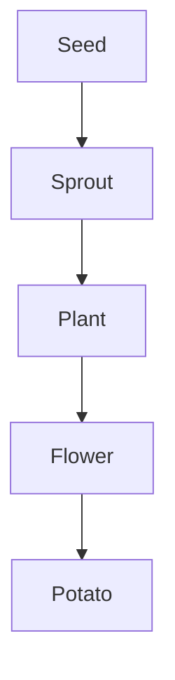

# Hello

This is a test 
## Potatoes

Potatoes are a versatile and widely consumed vegetable. They can be prepared in numerous ways, including boiling, baking, frying, and mashing. Potatoes are rich in carbohydrates, making them a great source of energy.

### Types of Potatoes

There are several types of potatoes, each with unique characteristics:
- **Russet Potatoes**: Ideal for baking and frying.
- **Red Potatoes**: Great for boiling and salads.
- **Yukon Gold Potatoes**: Perfect for mashing and roasting.

### Potato Growth Cycle

Here is a simple diagram illustrating the growth cycle of a potato plant:



### Nutritional Value

Potatoes are not only delicious but also nutritious. They contain essential vitamins and minerals such as Vitamin C, Vitamin B6, and potassium.

Enjoy your potatoes in various dishes and appreciate their contribution to a balanced diet!

### Code

```rust
fn main() {
    println!("abcd");
}
```