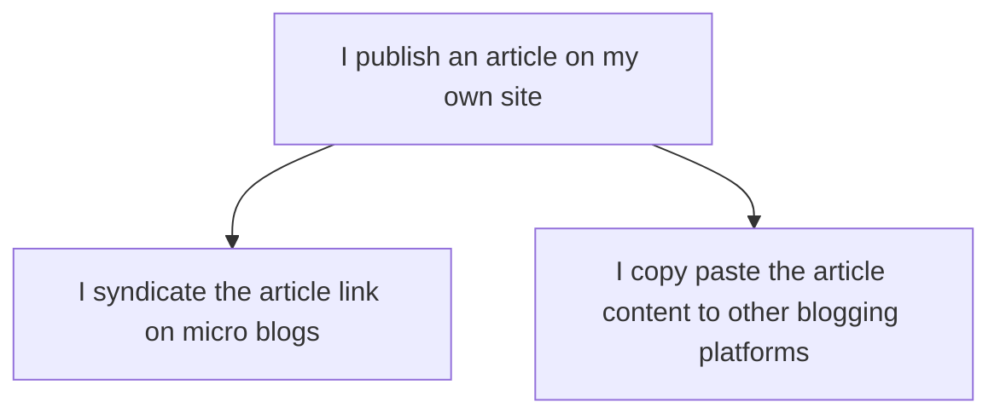

# POSSE

Recentemente eu postei no [Fediverso] sobre algumas coisas que
me arrependo na minha carreira profissional.

E a principal que me veio a mente foi o fato de eu ter 
parado de escrever regularmente +- em 2014.

Eu era um blogger bastante ativo, até participei de 
alguns desafios com o intuito de postar pelo menos 
uma postagem no blog a cada semana.

Ja mantive alguns blogs, mas em 2014 eu decidi parar 
de escrever e só agora que mei conta disso e quão ruim foi
essa decisão.

Coincidentemente na última decada nós vimos o surgimento
das midias sociais centralizadas, baseadas em engajamento
e meio "sem querer" entrei nessa, afinal, mais vale um post 
no Linkedin, ou uma thread no twitter ou um short no Instagram
ou investir no canal do Youtube, pois lá é que está o engajamento
ninguém liga para o meu blog.

Eu caí nessa armadilha, e você provavelmente também, e está tudo bem,
ainda dá tempo de recuperar o que é nosso.

## Ninguém liga para meu blog :pensive: 

Esse é o primeiro pensamento que devemos nos livrar, o blog não é um
motor de engajamento, é um histórico, é você escrevendo sua história,
ou pelo menos uma parte dela, inicialmente só você mesmo que precisa
"ligar" para o seu blog, escreva para você mesmo, para no futuro você
se lembrar daquele assunto ou momento, para você usar como referencia
quando precisar "provar" envolvimento em um tema, para usar como
bragging document etc.

Não importa se ninguém vai ler! mas acredite sempre tem alguém que lê.

## Mas eu nem escrevo bem :pencil:

Esse é o segundo pensamento que precisamos deixar de lado, você nunca
vai escrever bem se nunca escrever, este é o tipo de coisa que se adquire 
com prática, eu já escrevi bem, até livro eu escrevi, mas eu perdi essa 
pratica e agora tenho que reaprender, está sendo divertido.

## Mas eu não sei do que falar :speaking_head:

Terceiro ponto a vencer é esse, apenas abra um editor de texto e 
escreva, não precisa ser perfeito, não precisa ser técnico, não precisa ser longo,
podem ser apenas anotações, coisas que vc aprendeu, lista de artigos que vc leu,
lista de coisas que está estudando, qualquer coisa, mesmo que ainda não vá publicar,
crie uma pasta `textos` e vá escrevendo o que vier a mente lá dentro.

## Mas eu não sei criar um blog :abacus:

Comece simples, escreva em arquivos de texto, salve em um, diretório ai no seu computador, aprenda [Markdown], só este processo já será divertido.

Para publicar use um repositório no github, pode apenas colocar os markdowns diretamente lá ou até mesmo criar um blog e hospedar no [Github Pages]

>>>
&mdash; Ok, mas não vejo vantagem nisso, melhor eu publicar no medium, linkedin, dev.to,
substack etc onde terá mais audiencia!?
>>>

Concordo que essas redes são ótimos para panfletar, para atingir o publico, mas
não caia na armadilha de produzir conteúdo para essas plataformas, apenas use
elas para disseminar o seu, é a ai que entra o **POSSE**.

## POSSE :memo:

POSSE é um acronimo em inglês para: **P**ublish on your **O**wn **S**ite, **S**indicate **E**verywhere,
ou seja, Publique em seu Próprio Site, Distribua em todo lugar.

**POSSE** é sobre `posse` mesmo, é sobre você possuir o seu conteúdo, escrever ele
para você, sem pensar em um formato que agrade mais a rede X ou Y, sem pensar
em engajar mais ou ganhar mais likes, é foco 100% no conteúdo do seu jeito
com a sua identidade, em seu próprio site, mesmo que este site seja um simples
blog estático ou um repositorio de textos.

Após publicar em seu próprio site, publique o texto em todas as plataformas que 
desejar, seja copiando e colando integralmente o conteúdo (substack, dev.to, medium, linkedin)
ou apenas distribuindo link para o conteúdo original (mastodon, bsky, instagram etc)

Isso pode ser feito manualmente ou de maneira automatizada.

## Como começar? :beginner:

Para aplicar o **POSSE** você precisa de um site e de canais para distribuir.

### Tenha o SEU site!

Eu vou recomendar o [Marmite] pois além de ser a plataforma de blog que eu criei, é a que eu publiquei originalmente este texto que você está lendo e a que eu tenho condições de te dar algum suporte se você precisar de ajuda.

Você pode começar criando seu blog automaticamente com github pages usando o [Marmite 101]

Ou pode começar do zero, ai nos eu computador local usando o [Marmite Tutorial] e depois hospedar no [Github Pages]

### Distribua

#### Manualmente

Após publicar, copie a URL do seu post e publique em todas as redes sociais de micro blog, copie o texto integral e publique também em plataformas como dev.to, substack, medium, linkedin.

#### Automaticamente

Não existe uma receita única para fazer isso, a parte importante
é que o seu blog com [Marmite] tem feeds **RSS** então esses feeds
podem usados para publicação automática.

Federe! (essa palavra é estranha), mas significa distribuir o conteúdo no fediverso (Mastodon e afins), o [Marmite] conta com integração com o Hatsu, que automaticamente faz a federação dos seus posts para o fediverso.

Eu criei um projeto que lê um feed e publica os novos itens no Bluesky [rss2bsky] 

A mesma estratégia pode ser usada para publicar em outras redes.

## Conclusão

Existem diversas alternativas para você estar no controle do conteúdo que você gera na internet, ter o seu blog é o primiro passo, depois eu recomendo ter sua própria instância no fediverso com Mastodon ou GoToSocial.

O **importante** é ter a POSSE dos seus textos.
