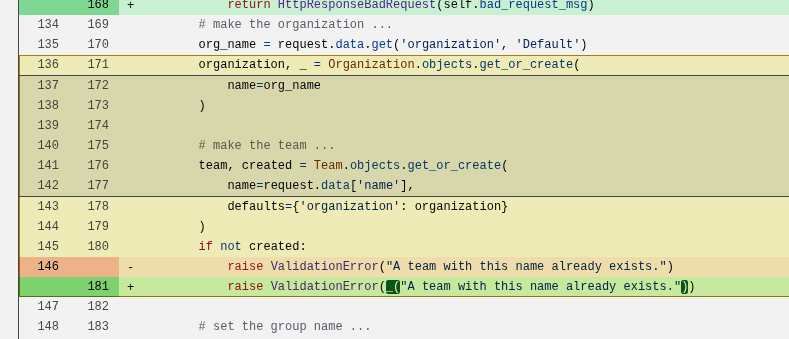

# Stop using underscore as alias for gettext

I've been using Django for a while now, and I've seen a lot of people using the underscore as an alias for gettext.

```python
from django.utils.translation import gettext as _
```
and also

```python
from django.utils.translation import gettext_lazy as _
```

This is a bad practice, I call it **"The Thousand Dollar Mistake".**


## History about this practice

The practice of using underscore (`_`) as an alias for gettext comes from the GNU gettext library, which has been around since the 1990s. In C and other languages, `_()` became the de facto standard for marking strings for translation. When Python adopted gettext, this convention carried over, and Django followed suit. The underscore was chosen because it's short, unobtrusive, and doesn't clutter the code when you have many translatable strings.


> [!important]
> As pointed out by Osvaldo Santana on the [[#comments]] there are some external tools that will expect the exact form `_()` ad those tools will
> statically analyse the codebase looking for the pattern `"\s_(.*.)"`, so if you use external translations tools it might be better to stick with this patten and instead put linters in place to check for reassignment of `_` 

## What it does 

The `gettext` function (and its lazy variant `gettext_lazy`) is Django's internationalization (i18n) mechanism. It marks strings for translation and returns the translated version based on the current language setting. When you use `_("Hello")`, Django will look up "Hello" in the translation catalogs and return the appropriate translation for the active language. The lazy version defers the translation until the string is actually used, which is important for module-level code that runs before Django's language detection.

## What is the problem?

This is a screenshot from a production code where I found this problem, it took me a while to spot the problem, the API was returning a 500 error, and the error was not very helpful, more people were affected by this, and it was a pain to debug.

Can you spot the problem?



## Explanation

The problem is that in the top of the file gettext_laxy is imported and aliased to `_`, then, later in the code the `_` is assigned to the tuple result of `organization, _ = Organization.objects.get_or_create(name="Organization")` this get_or_create returns a tuple with the object and a boolean, the boolean is not used, but the `_` is assigned to it, this is a problem because the `_` is already assigned to the gettext_lazy alias, and this is not the expected behavior.

So when the `_` is used as a transaltion function it fails because booleans are not callable.

## Correct way of doing it

Instead of using the underscore alias, use explicit, descriptive names:

```python
from django.utils.translation import gettext, gettext_lazy

# Use the full name
message = gettext("Hello, world!")
lazy_message = gettext_lazy("Welcome to our site")
```

Or, if you must use an alias, choose something more descriptive:

```python
from django.utils.translation import gettext as translate
from django.utils.translation import gettext_lazy as translate_lazy

# Now it's clear what's happening
message = translate("Hello, world!")
lazy_message = translate_lazy("Welcome to our site")
```

This way, when someone (including future you) reads the code, they immediately understand that translation is happening, not some mysterious underscore operation that could be confused with Python's built-in `_` variable or other uses of underscore.

## Conclusion

While using `_` as an alias for gettext is a widespread convention, it can lead to confusing bugs that are hard to track down. The underscore has too many meanings in Python: it's used for private attributes, as a throwaway variable in loops and unpacking, and in the REPL to reference the last result. When you add gettext to the mix, it becomes a recipe for subtle bugs.

By using explicit names like `gettext` or `translate`, you make your code more readable, reduce the chance of namespace collisions, and save yourself (and your team) from debugging sessions that could cost far more than the few extra characters you type. Remember: explicit is better than implicit, and readability counts. Your future self will thank you.

