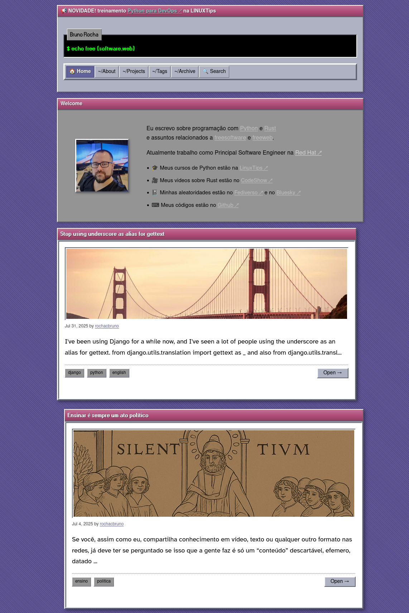
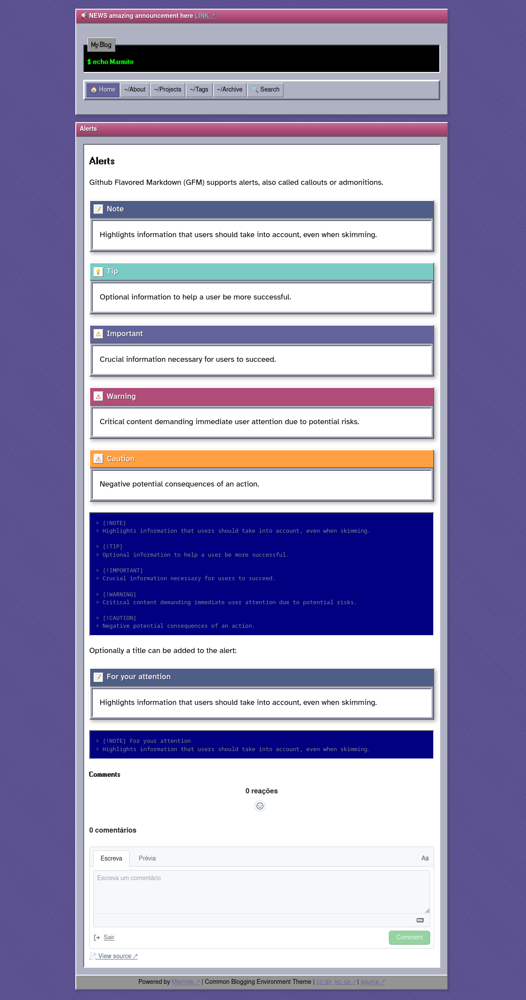
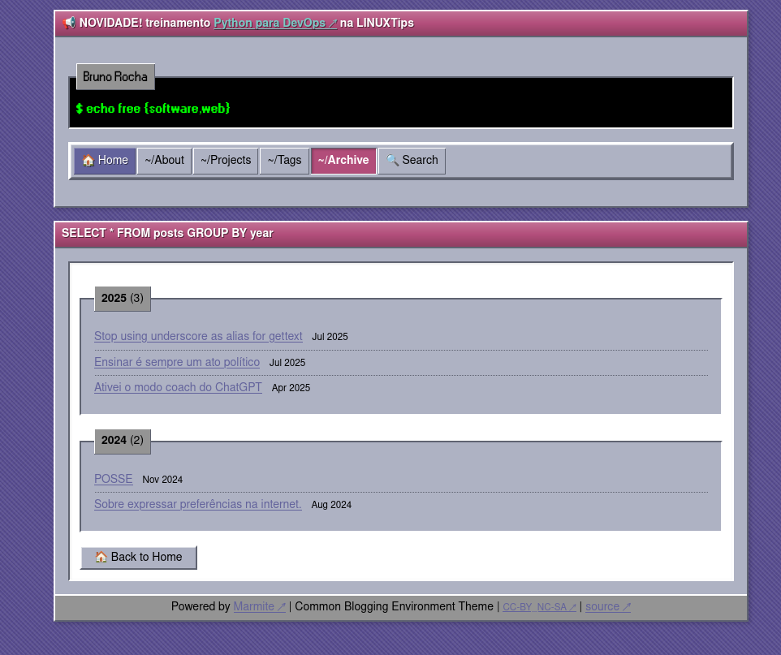
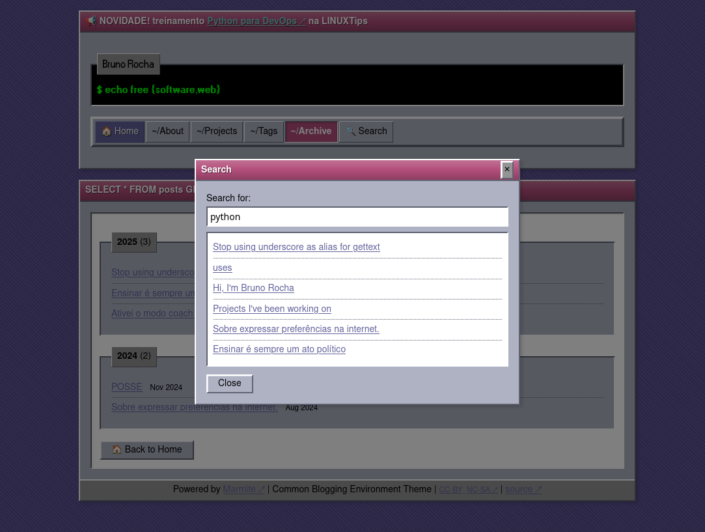
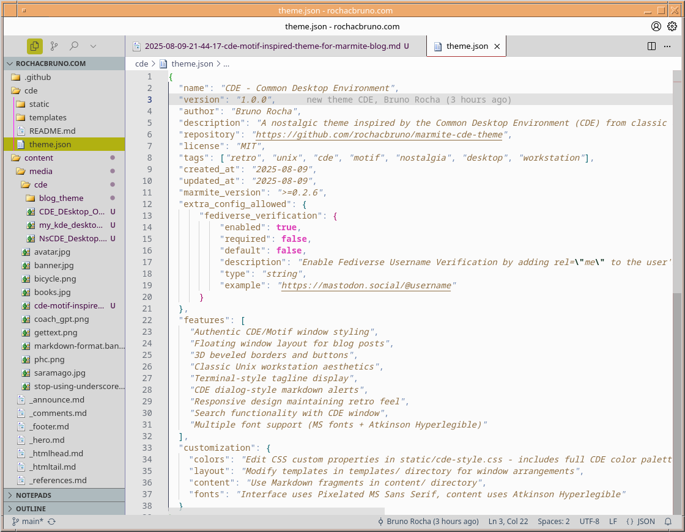

# CDE Motif-Inspired Theme for Marmite Blog

I don't know why exactly, but I really like the retro look of old desktop environments for Unix, Solaris and Linux. Maybe it's because I spent countless hours in the late 90s having fun with systems like OpenStep, CDE, Motif, XFCE, early KDE versions, and window managers like WindowMaker, FVWM, Openbox and Fluxbox.

## The Modern Design Fatigue

Recently, I started getting really tired of modern-looking design. Everything looks the same , flat, minimal, with tons of white space and those pastel gradients that seem to be everywhere. One day, while trying the NsCDE project, I realized that this kind of retro design actually made me happy!

I was scrolling my mastodon feed and came across [this comparison between CDE and NsCDE](https://www.nequalsonelifestyle.com/2022/07/28/installing-cde-and-comparing-with-nscde/) and I was intrigued with the idea of trying NsCDE.

I have been a long time user of XFCE and I even was a contributor to the project translations back on early 2000s, then I used XFCE for a long time and migrated to i3wm and then KDE, I like KDE but to be honest sometimes I think about moving back to XFCE for its simplicity and speed, there are some features on KDE now that I got used to like Krunner and Activities that I still have to find replacements on XFCE (maybe rofi?) but I don't know about the activities (which is very different from XFCE multi workspace)

## Why Retro UI Design Works

There's something about these old interfaces that just feels right. The buttons look like actual buttons you can press. The windows have clear borders. Everything has depth and texture. It's not trying to be invisible or get out of your way , it's proudly there, doing its job.

I also came across "Making Linux look like Windows 98" from diinki with arguments about Windows 98-style design being more comfortable design. 

<!-- .youtube id=4w1MPd_Y7EE -->

## CDE

The Common Desktop Environment was a collaborative effort between HP, IBM, Sun, and other UNIX vendors to create a unified desktop experience that inspired probably all the modern desktop environments we have today.

From Wikipedia:

>>>
The [Common Desktop Environment (CDE)](https://en.wikipedia.org/wiki/Common_Desktop_Environment) is a desktop environment for Unix and OpenVMS, based on the Motif widget toolkit. It was part of the UNIX 98 Workstation Product Standard,and was for a long time the Unix desktop associated with commercial Unix workstations. It helped to influence early implementations of successor projects such as KDE and GNOME, which largely replaced CDE following the turn of the century. 
>>>

I also found this very fun and interestint CDE marketing video from 1996

<!-- .youtube id=tR7G-wIm-e8 -->

### Customizing KDE

After my NsCDE experiments, I started customizing my KDE environment to look like CDE, and I'm absolutely loving it. Here's my desktop now:

It is not exactly like CDE yet because I am not very good on Linux Ricing, I hope to get it to a point where it is close to the original CDE.

Compare that to the original CDE And the modern NsCDE implementation:

<!-- .gallery path=cde_desktop --> 

### I want Motif everywhere! (or at least a CDE inspired look)

Now I am really trying to get Motif inspired look & feel everywhere and sadly it looks like interfaces became so modern (not in a good way) that I am not able to find any Motif inspired themes.

### Mobile

Sadly, my Xiaomi phone doesn't have a CDE-inspired theme, nor could I find a Windows 98 style for it. Modern mobile operating systems seem allergic to anything that doesn't follow the current design trends. But that gave me an idea...

## Blog

If I couldn't have CDE on my phone, at least I could bring that look and feel to my blog! So I created a new theme for my [Marmite static site generator](https://rochacbruno.github.io/marmite/), and here are the results.

For this I used a reference I found on a blog that was not exactly the original CDE pallete but the colors from an alternative CDE Motif theme.

### The Color Scheme

Finding the right colors was crucial. I discovered [this CDE color scheme](https://www.swisswuff.ch/wordpress/?p=485), and that was all I needed. The classic Solaris CDE colors include:

- Front window border: `#b24d7a` <span style="color: #b24d7a;"> (that distinctive mauve-pink) </span>
- Window pane background: `#aeb2c3` <span style="color: #aeb2c3;"> (the classic gray-blue) </span>
- Desktop background: `#574c8f` <span style="color: #574c8f;"> (that deep purple we all remember) </span>
- Accent Colors: Various blues, greens, and purples

### The Results

Here's how the blog looks with the new CDE theme:



The post listing with that classic CDE aesthetic:



Group pages maintaining the consistent look:



And even the search functionality got the retro treatment:



## Technical Implementation

The theme uses authentic CDE design principles:
- **3D beveled borders** on all interactive elements
- **Workspace-style navigation** with clear visual hierarchy
- **Motif-inspired widgets** that look like they belong in a 1994 UNIX workstation
- **Classic color palette** directly from CDE specifications

I tried ti recreate the inset and outset borders that gave CDE its distinctive 3D appearance, while the typography uses monosspace system fonts that would have been common on UNIX systems of that era, but also I preferred to use MS Sans Serif for some terminal elements and ATkinson Hyperlegible font for the main content.

## Create your own Blog with the CDE theme


```bash
# Install marmite from git (theme support will come soon on version 0.2.7)
cargo install --git https://github.com/rochacbruno/marmite.git
# Start a new blog
marmite myblog --init-site
# Set the theme to cde
marmite myblog --set-theme https://github.com/rochacbruno/marmite-cde-theme 
# Write a post
marmite myblog --new "My first post" -t "tag1,tag2"
# Render the blog
marmite myblog --serve
```


## Why This Matters

There's more to this than just nostalgia. These older interfaces were designed with different priorities, everything looks interactive because it has visual affordances, once you learn one CDE application, you know them all, dense information display without being cluttered and no ambiguity about what's clickable or what's selected.

Maybe it is a sign of my age, but I am really more happy with the retro look&feel for my day to day work, 

For work purposed I am required to use an VSCode based editor and I was able to customize it to look like a retro editor.




## Conclusion

Do you have any other retro design theme or resource to share?