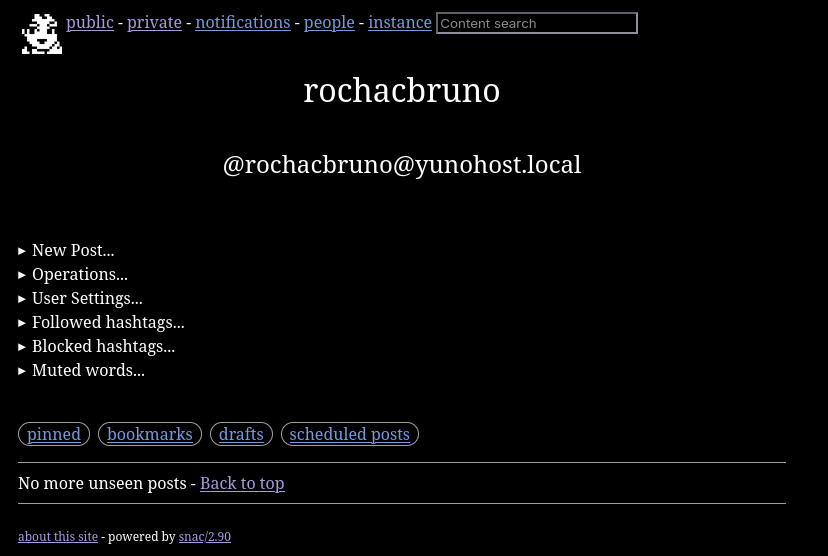

# Deploy your own Fediverse instance with Snac

If you want to be in the Fediverse without relying on big intances,
or if you just want to own your data and your identity on the network,
running your own instance is the way to go.

The problem is that most Fediverse software like Mastodon requires a lot of
resources, complex setups, and ongoing maintenance. That is where Mastodon alternatives
such as **GoToSocial** and **snac** comes in.

**GoToSocial** is amazing and powerful, this is the one I have been using for a long time,
it is written in Go and used PostgreSQL for database, can really handle mid/large instances.

However, deploying GoToSocial still requires some skills and the maintanance of a GTS instance
requires knowing how to manage a database because the DB migrations are the main point of
issues if something goes wrong (but it rarely goes wrong, GTS is preety stable)

I personally find **Snac** more appealing for single user or small instances, because
it is really simple and can even be deployed along side on your existing VPS or Home Server.

**snac** (Social Networks Are Crap) is a minimalistic, lightweight ActivityPub instance
written in C. It is perfect for single user instances or small communities, and it
runs so light that even a Raspberry Pi can handle it without breaking a sweat.

You can get an idea of how it looks like by acessing my own instance on https://cesar.rocha.social/bruno 



One of the things I find genius about snac is the decision to use the filesystem as
its database. No PostgreSQL, no Redis, no migrations. Just files and hard links on
disk. This makes everything simpler: backups are just a `tar` or `rsync`, there is
nothing to tune or vacuum, and you can inspect your data with plain old `ls` and `cat`.

The web interface has zero JavaScript, no cookies, and no tracking. It looks simple
but it is surprisingly powerful. You can do everything from the browser without
needing any external client. That said, snac fully implements the Mastodon API, so
all the popular Mastodon clients like Tusky, Phanpy, Ice Cubes, and Elk work
perfectly with it.

And it is not just a barebones server either. Snac supports modern Fediverse features
like account migration (Move), scheduled posts, polls, emoji reactions, custom emojis,
media proxying for privacy, and even Webmention support.

In this guide I will walk you through the complete process of deploying snac on a
fresh Debian system, from compilation to a fully federating instance with systemd
and nginx.

## What you will need

- A VPS or home server running **Debian 11+** (or Ubuntu 20.04+)
- A **domain name** pointing to your server (e.g. `snac.yourdomain.com`)
- Root or sudo access
- About 10 minutes of your time

> [!note]
> Snac can also be deployed to a Container the official repo includes an example https://codeberg.org/grunfink/snac2/src/branch/master/docker-compose.yaml


## Why Snac?

Before jumping into the setup, here is why snac is a great choice:

- **Minimal dependencies**: only needs OpenSSL and curl
- **No database**: everything is stored as files on the filesystem using hard links
- **Multiuser**: you can host multiple accounts on a single instance
- **Mastodon API compatible**: works with apps like Tusky, Ice Cubes, Megalodon, Phanpy, Elk, etc.
- **Tiny footprint**: runs happily on a $5/month VPS or even a Raspberry Pi
- **Federation works out of the box**: tested with Mastodon, Pleroma, Friendica, Misskey, and others

## A note about domain choice

Before you start, you need to decide how your instance will be accessible.
Snac supports two options:

- **Subdomain**: `snac.yourdomain.com` (recommended)
- **Subpath**: `yourdomain.com/snac`

> [!important]
> This choice is **permanent**. Once you initialize snac with a host name and path
> prefix, it cannot be changed later. Your identity on the Fediverse is tied to this
> URL, and all federation, followers, and interactions depend on it. Choose wisely
> before running `snac init`.

For this guide I will use `snac.yourdomain.com` as the example domain.

## Step 1: Install build dependencies

First, update your system and install the required packages:

```bash
sudo apt update && sudo apt upgrade -y
sudo apt install -y build-essential libcurl4-openssl-dev libssl-dev git
```

That is it. No Ruby, no Node.js, no Redis, no PostgreSQL.

## Step 2: Build and install snac

Clone the repository and compile:

```bash
git clone https://codeberg.org/grunfink/snac2.git
cd snac2
make
sudo make install
```

> [!note]
> On Ubuntu 20.04 or some older Debian versions, you may need to add `LDFLAGS=-lrt`
> to the make command: `make LDFLAGS=-lrt`

This installs the `snac` binary to `/usr/local/bin/` and the man pages to
`/usr/local/man/`.

You can verify the installation:

```bash
snac
```

It should print the usage information and available commands.

## Step 3: Create a system user

Create a dedicated user for running snac:

```bash
sudo useradd -r -s /usr/sbin/nologin -m -d /home/snac snac
```

> [!note]
> Make sure the filesystem where `/home/snac` lives supports hard links (ext4, xfs,
> btrfs all work fine). snac makes heavy use of hard links for storage, so do not
> place the data directory on a filesystem that does not support them.

## Step 4: Initialize the data directory

Run the init command as the snac user:

```bash
sudo -u snac snac init /home/snac/data
```

This will ask you a few questions interactively:

- **Host name**: your public domain (e.g. `snac.yourdomain.com`)
- **Path prefix**: leave empty unless you want snac under a subpath like `/snac`
- **Network address**: use `127.0.0.1` (nginx will handle public traffic)
- **Port**: use `8001` (or any available port)

The configuration is saved to `/home/snac/data/server.json`. You can edit it
later to tune things like timeline purge days, queue settings, and more.

Here are some useful settings you might want to adjust in `server.json`:

```json
{
    "title": "My Fediverse Instance",
    "short_description": "A personal snac instance",
    "admin_email": "admin@yourdomain.com",
    "proxy_media": true,
    "strip_exif": false,
    "timeline_purge_days": 120,
    "dbglevel": 0
}
```

Setting `proxy_media` to `true` is recommended for privacy, as it proxies remote
media through your instance instead of having your visitors fetch images directly
from external servers. And `strip_exif` removes metadata from uploaded images, flip to true if you want it.


> [!important]
> strip_exif requires imagemagick and ffmpeg to be installed and the process can increase the size of images significantly

## Step 5: Create your first user

```bash
sudo -u snac snac adduser /home/snac/data yourusername
```

It will ask for a display name, and then it will generate a random password
and print it to the terminal. Copy it and save it somewhere safe. You can
change it later from the web interface or reset it with `snac resetpwd`.

## Step 6: Set up systemd

Create the service file at `/etc/systemd/system/snac.service`:

```ini
[Unit]
Description=snac2 ActivityPub instance
Documentation=https://codeberg.org/grunfink/snac2
After=network.target
Wants=network-online.target

[Service]
User=snac
Group=snac
ExecStart=/usr/local/bin/snac httpd /home/snac/data
Restart=on-failure
RestartSec=5
NoNewPrivileges=yes
PrivateTmp=yes
PrivateDevices=yes
ProtectSystem=full

[Install]
WantedBy=multi-user.target
```

Enable and start the service:

```bash
sudo systemctl daemon-reload
sudo systemctl enable snac
sudo systemctl start snac
```

Check that it is running:

```bash
sudo systemctl status snac
```

You can also follow the logs in real time:

```bash
sudo journalctl -u snac -f
```

## Step 7: Configure nginx as reverse proxy

Install nginx and certbot if you have not already:

```bash
sudo apt install -y nginx certbot python3-certbot-nginx
```

Create a new site configuration at `/etc/nginx/sites-available/snac`:

```nginx
server {
    listen 80;
    server_name snac.yourdomain.com;

    client_max_body_size 100M;

    location / {
        proxy_pass http://127.0.0.1:8001;
        proxy_set_header Host $http_host;
        proxy_set_header X-Forwarded-For $remote_addr;
    }
}
```

Enable the site and get a TLS certificate:

```bash
sudo ln -s /etc/nginx/sites-available/snac /etc/nginx/sites-enabled/
sudo nginx -t
sudo systemctl reload nginx
sudo certbot --nginx -d snac.yourdomain.com
```

Certbot will automatically modify your nginx config to add HTTPS and redirect
HTTP traffic.

> [!important]
> The `Host` and `X-Forwarded-For` headers are essential. Without `Host`,
> snac will generate wrong URLs. Without `X-Forwarded-For`, the login
> rate limiting will not work properly.

### Optional: Media caching with nginx

If you enabled `"proxy_media": true` in your `server.json`, snac will proxy remote
media through your instance for privacy. You can add nginx caching to reduce
load on your server.

Add to your `/etc/nginx/nginx.conf` inside the `http` block:

```nginx
proxy_cache_path /var/cache/nginx/snac_media levels=1:2 keys_zone=snac_media:10m
                 max_size=1g inactive=1d use_temp_path=off;
```

Then add this location block **before** the catch all `location /` in your site config:

```nginx
location ~ ^/.+/(x|y)/ {
    proxy_cache snac_media;
    proxy_pass http://127.0.0.1:8001;
    proxy_set_header Host $http_host;
    proxy_set_header X-Forwarded-For $remote_addr;
    proxy_cache_valid 200 1d;
    proxy_cache_valid 404 1h;
    proxy_ignore_headers "Cache-Control" "Expires";
    proxy_cache_use_stale error timeout updating http_500 http_502 http_503 http_504;
    proxy_cache_lock on;
    add_header X-Proxy-Cache $upstream_cache_status;
}
```

Create the cache directory and reload:

```bash
sudo mkdir -p /var/cache/nginx/snac_media
sudo chown www-data:www-data /var/cache/nginx/snac_media
sudo nginx -t && sudo systemctl reload nginx
```

## Step 8: Verify federation

At this point, your instance should be live and federating. Let us verify:

```bash
curl -s "https://snac.yourdomain.com/.well-known/webfinger?resource=acct:yourusername@snac.yourdomain.com"
```

You should get a JSON response with your account information. If that works,
your instance is discoverable by the rest of the Fediverse.

Now open your browser and go to `https://snac.yourdomain.com/yourusername`
to see your profile. Log in through the web interface, write your first post,
and try following someone from another instance.

You can also use any Mastodon compatible app (Tusky, Ice Cubes, Phanpy, Elk, Megalodon, etc.)
by pointing it to your instance URL and logging in with your credentials.

## Administration tips

Here are some useful commands for day to day management:

| Task | Command |
|------|---------|
| Add a new user | `sudo -u snac snac adduser /home/snac/data username` |
| List all users | `sudo -u snac snac userlist /home/snac/data` |
| Reset a password | `sudo -u snac snac resetpwd /home/snac/data username` |
| Check server state | `sudo -u snac snac state /home/snac/data` |
| Block an instance | `sudo -u snac snac block /home/snac/data instance.com` |
| Unblock an instance | `sudo -u snac snac unblock /home/snac/data instance.com` |
| Purge old data | `sudo -u snac snac purge /home/snac/data` |
| Export user data | `sudo -u snac snac export_csv /home/snac/data username` |

### Creating a snac-admin wrapper

Typing `sudo -u snac snac ... /home/snac/data` every time gets old fast.
You can create a simple wrapper script to make administration easier.

Create `/usr/local/bin/snac-admin`:

```bash
#!/bin/bash
# Wrapper script for snac2 CLI commands
# Usage: snac-admin <command> [options...]
# Example: snac-admin adduser myuser
#          snac-admin resetpwd myuser
#          snac-admin userlist

# Re-exec as the snac user if running as root
if [ "$(id -u)" -eq 0 ]; then
    exec sudo -u snac "$0" "$@"
fi

export SNAC_BASEDIR="/home/snac/data"
exec /usr/local/bin/snac "$@"
```

Make it executable:

```bash
sudo chmod +x /usr/local/bin/snac-admin
```

Now you can simply run:

```bash
sudo snac-admin adduser newuser
sudo snac-admin userlist
sudo snac-admin resetpwd someuser
```

## Upgrading snac

When a new version is released, updating is straightforward:

```bash
cd snac2
git pull
make
sudo make install
```

If the release notes mention a data format change, stop the service first and
run the upgrade command:

```bash
sudo systemctl stop snac
sudo -u snac snac upgrade /home/snac/data
sudo systemctl start snac
```

> [!important]
> Never run the upgrade command while the service is active.  
> Always backup your data directory before updating, remember, the database are the files under `/home/snac/data` simply `cp -R /home/snac/data /backup/location` or use your preferred compression and syncing tool.

## The easy way: YunoHost

If you do not want to deal with manual configuration, nginx, systemd, and TLS
certificates, there is an even simpler option.

[YunoHost](https://yunohost.org) is a server operating system that makes
self hosting accessible to everyone. It handles domain management, TLS,
backups, user management, and application installation through a web interface.

Snac is available as an official YunoHost application. You can install it
with a few clicks from the YunoHost admin panel or via the command line:

```bash
yunohost app install snac
```

The YunoHost package takes care of everything: compiling from source, configuring
nginx with proper headers, setting up systemd with security hardening, creating
the admin user, and even providing a configuration panel where you can tweak
over 50 settings without touching any JSON files. It also handles backups and
restores automatically, so you can migrate between servers without losing data.

Check the official package page for more details:
[https://apps.yunohost.org/app/snac](https://apps.yunohost.org/app/snac)

## Conclusion

Running your own Fediverse instance does not have to be complicated or expensive.
With snac, you get a fully functional ActivityPub server that compiles in seconds,
uses almost no resources, and federates perfectly with the rest of the network.

Whether you set it up manually on a Debian VPS, run it on a Raspberry Pi at home,
or use YunoHost for a managed experience, you will have full control over your
social presence on the Fediverse.

The source code is available at [codeberg.org/grunfink/snac2](https://codeberg.org/grunfink/snac2).

Now go follow me at my GtS [@bruno@rocha.social](https://go.rocha.social/@bruno) AND/OR my Snac [@bruno@cesar.rocha.social](https://cesar.rocha.social/bruno)
