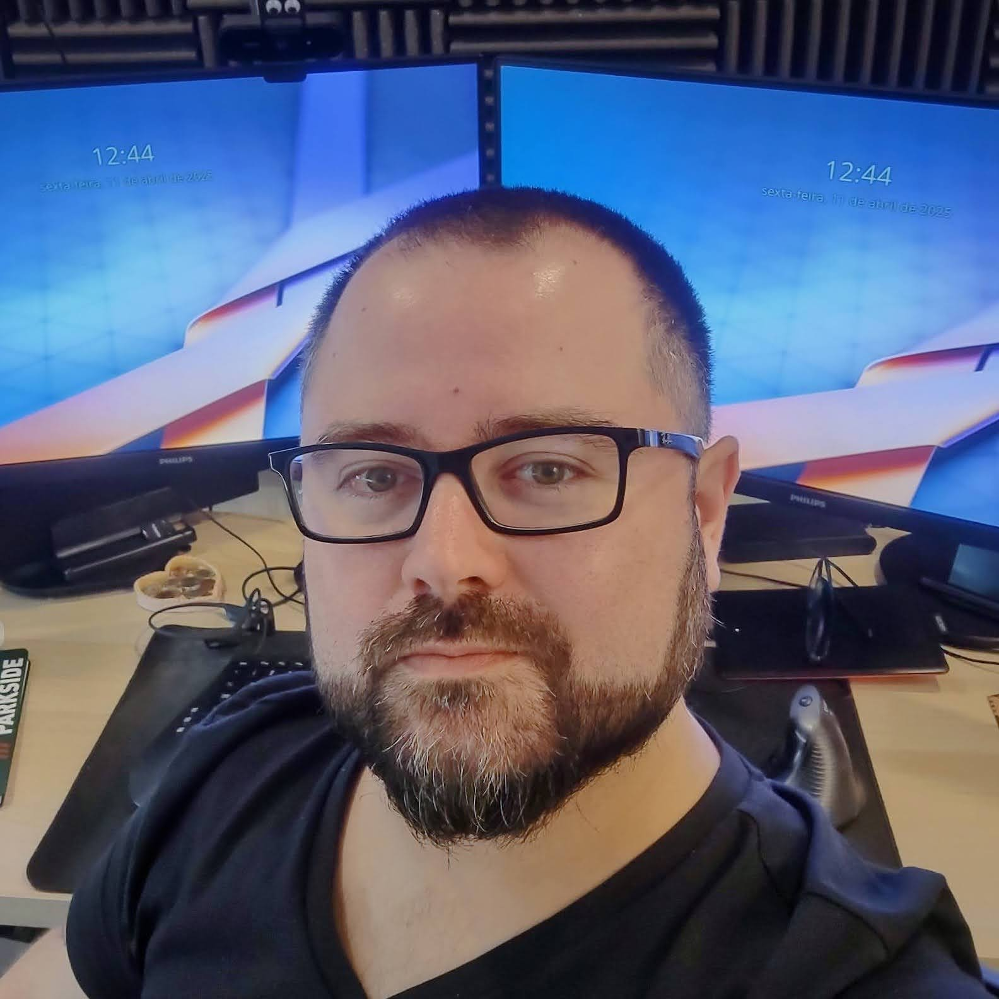

Eu escrevo sobre programação com [[#Python|tag-python]] e [[#Rust|tag-rust]]  
e assuntos relacionados a [[#freesoftware|tag-freesoftware]] e [[#freeweb|tag-freeweb]].  

Atualmente trabalho como Principal Software Engineer na [Red Hat]
- 🎓 Meus cursos de Python estão na [LinuxTips]
- 🎥 Meus videos sobre Rust estão no [CodeShow]
- 📓 Minhas aleatoridades estão no [Fediverso] e no [Bluesky]
- ⌨ Meus códigos estão no [Github]

